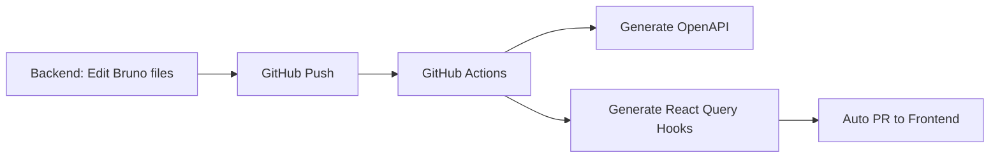

# bruno-api-typescript

> Automate API synchronization between Bruno and Frontend repositories using GitHub Apps

**[한국어 문서 (Korean Documentation)](./README.ko.md)**

This project automatically generates OpenAPI specs and React Query hooks from Bruno `.bru` files via GitHub Actions.

Backend developers write Bruno files, and the rest is automated - TypeScript types and hooks are generated in the frontend repository with automatic PR creation.

## How It Works

## Setup

See [Korean Documentation](./README.ko.md) for detailed setup instructions.

## License

MIT
